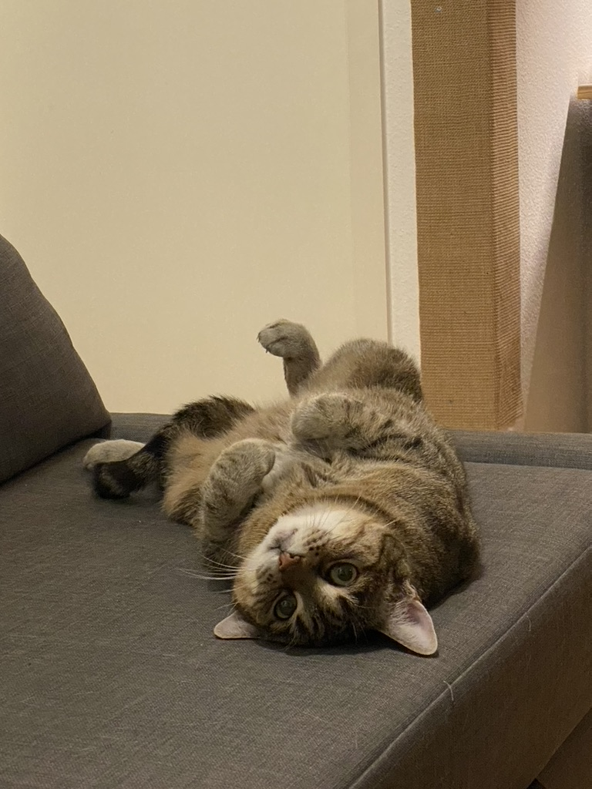

# Purrfect Mail 😺📧
Send Images from your fluffy cat per mail.  
I started the project with the idea of taking a picture every day with a Raspberry Pi (whose camera is triggered by a sensor) and sending it as a kind of "newsletter from my cat".

## Project state
🏗️ work in progress 🏗️  
It is currently possible to store some pictures in the catGallery folder. One of these is selected at random and sent. If the folder is empty, Minka is sent.  
**Next Steps**
- buy camera for raspy
- implement camera- and sensor usage to trigger the mailing

## How to use
1) use the [.env_sample](.env_sample) to store your gmail-credentials and the mail-adress from the recipient. (How to setup the gmail account?! Use this [tutorial](https://bc-robotics.com/tutorials/sending-email-using-python-raspberry-pi/)!)
2) install dotenv: pip install python-dotenv
3) store some images from your cat (or what ever you want to send) in the 
[catGallery](/catGallery)
4) change CAT_NAME in the main.py
5) run the main.py

## Default cat
By default the mail will contain the [picture from minka](minka.jpeg). She always wanted to surf the web...  
 

## Use your own cat-content!
Add some fluffy images to the [catGallery](catGallery) folder

## Nooby Code
This is my first python project - the code might not be very good from your point of view. So feel invited to contribute and help me to get this nice and smooth ;)  

## Thanks!
To implement the mailing i followed the awesome tutorial from [Chris@CBR](https://bc-robotics.com/tutorials/sending-email-attached-photo-using-python-raspberry-pi/)
